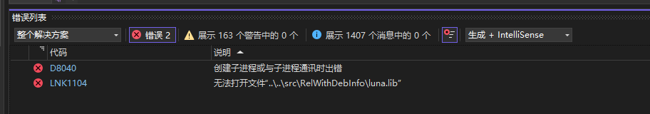
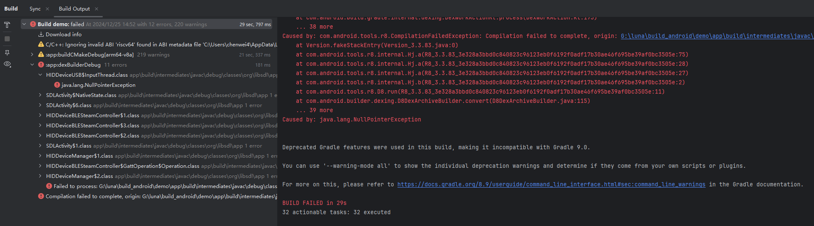

#  <span style="font-size: 1.2em;">LUNA（月神）</span>

> 一次开发，多端运行。\
> Write Once, Run Anywhere.

English version: [readme_en.md](readme_en.md)

## 目录

- [ LUNA（月神）](#-luna月神)
  - [目录](#目录)
  - [项目说明](#项目说明)
  - [项目运行示例](#项目运行示例)
  - [构建](#构建)
    - [Windows：](#windows)
    - [macOS：](#macos)
    - [iOS：](#ios)
    - [Android：](#android)
  - [如何开始自己的项目](#如何开始自己的项目)
  - [TODO-LIST](#todo-list)
  - [技术选型](#技术选型)
    - [关于 GUI 框架](#关于-gui-框架)
    - [第三方库集成](#第三方库集成)
  - [设计理念](#设计理念)
  - [FAQ](#faq)
  - [历史](#历史)


## 项目说明

LUNA 是一个服务于图形图像算法开发的跨平台 C++ 框架， 秉承 “**一次开发，多端运行**” 的理念， 致力于为图形图像算法开发提供一个高效、灵活、跨平台的开发环境。

LUNA 的开发动机来源于团队的项目实践，在图形图像算法的开发过程中，除算法的核心开发工作之外，我们往往还需要：

- 处理不同格式的输入（Video, Image, YUV, Camera 等）。
- 将图像结果保存为不同格式的输出（Video, Image, YUV 等）。
- 将图像结果进行可视化和对比。
- 对算法进行实时调参。
- 对性能进行测试。
- GPU 相关算法开发，需要重新封装 OpenGL 上下文和接口。
- 在 PC 端开发完成之后，将算法移植到平台（Android, iOS）时，需要重新搭建项目，还需要支持本地文件或者 Camera 输入。


在以往的开发过程中，每一个独立的项目，都需要周而复始的重复以上工作， 因此我们希望找到一种方案，能够让我们从繁琐的重复工作中解放出来， 把更多的精力投入到算法的开发和创新中去。

基于上述原因，我们逐渐搭建了 LUNA 框架， 试图解决上述问题，让开发者专注于算法本身的逻辑，而无需关心跨平台的移植工作。

这些工作主要包括：

- 对图像读取进行统一的抽象和封装，支持 Video, Image, YUV, Camera(PC, Android, iOS) 等输入。
- 对图像输出进行统一的抽象和封装，支持 Video, Image, YUV 等输出，支持代码或者 GUI 配置导出。
- 运行过程中，支持图像的可视化，方便实时查看和对比。
- 支持自定义算法调参的 GUI 模块视图，方便实时调参。
- 实现 profile 模块，方便测试算法性能，并通过控制台或者 GUI 可视化。
- 对 OpenGL 进行浅封装，屏蔽不同平台 OpenGL 的差异，并提供统一的接口。
- 对于 OpenGL 3D 绘制，提供一整套基础的绘制功能（点、线、面、网格绘制，正常光流、延迟光照，阴影等）。
- 统一的抽象框架，屏蔽不同平台的差异，无需任何代码修改，即可运行在不同平台。

到目前为止，LUNA 已经初具雏形，较好的实现了其设定目标。我们希望 LUNA 能够成为图形图像算法开发者的一把瑞士军刀 / 一个高可用的脚手架， 以提升算法的开发效率。

## 项目运行示例

| PC 端 ||
|---------|---------|
|  | |

| 移动端 ||
|---------|---------|
|  | |


## 构建
LUNA 目前支持 Windows, macOS, iOS 和 Android平台。 除 Android 外，所有平台采用 Cmake (3.25 及以上版本) 生成项目文件。

如果没有安装 CMake，请先安装 CMake。

### Windows：
windows 平台使用 CMake 生成 MSVC 项目文件。

MSVC 版本： Visual Studio 2022 及以上版本。

构建命令：

```
build_for_vs.bat
```
上述命令将生成 VS 项目文件，项目文件生成位于 `build_vs` 文件夹下。

打开 vs 项目文件，选择 Debug 或 Release 模式，设置启动项目，即可进行编译。


第一次运行时会报 DLL 找不到的错误，请执行 `INSTALL` 工程，将依赖的 DLL 拷贝到可执行文件目录下。

### macOS：
macOS 平台使用 CMake 生成 Xcode 项目文件。如果没有安装 Xcode，请先安装 Xcode。

macOS 下需要通过 `brew` 命令安装 `glfw3` , `glew`, `opencv` 等依赖库。

```
brew install glfw3
brew install glew
brew install opencv
```

然后运行构建命令：

```
build_for_macos.sh
```

上述命令将生成 Xcode 项目文件，项目文件生成位于 `build_macos` 文件夹下。

打开 Xcode 项目文件，选择对应的 scheme，即可进行编译和运行:


### iOS：
ios 平台使用 CMake 生成 Xcode 项目文件。如果没有安装 Xcode，请先安装 Xcode。

构建命令：

```
build_for_ios.sh
```

上述命令将生成 Xcode 项目文件，项目文件生成位于 `build_ios` 文件夹下。

打开 Xcode 项目文件，选择对应的 scheme，在 signing & capabilities 下设置好签名，连接iphone真机（暂不支持 simulator），即可进行编译和运行:


### Android：

Andoid 平台使用 CMake 来构建生成 C++ native 部分代码，在项目根目录下的 `CMakeLists.txt` 文件中配置所需要运行的 App。
如下图所示：


如果没有安装 Android Studio，请先安装 Android Studio。

然后使用 Android Studio 打开 `build_android` 文件夹下的 demo 工程，连接 Android 设备，即可编译和运行。

注意编译 c++ 所使用的 NDK 版本为 NDK27，详见项目中的 `build.gradle` 文件。

首次安装 Android Studio 进行编译时，可能需要设置环境变量 `ANDROID_HOME` (Android SDK 目录)， 或者通过在 `local.properties` 指定 `sdk.dir` 变量。

## 如何开始自己的项目

目前 LUNA 已经有多个项目，位于 `apps` 文件夹下，可供参考。

作为初学者，可以先从 `hello_luna` 项目开始，在这个项目中，我们演示了一个简单的基于 openGL 进行图像中心 crop 操作的 demo:


你可以阅读此 demo 的源码，理解 `luna` 最核心的概念。在建立自己的 App 时，可以将此项目中的代码拷贝到你自己的 APP 中，以此作为基础。

所有的 App 都继承自 `ImGuiAppBase`，你最好先仔细理解下图所展示的 App 主流程（pipeline）：


关于 LUNA，作者（Chen Wei）还曾经有过一次分享，可以查看：[跨平台图形图像开发框架—LUNA.pptx](docs/跨平台图形图像开发框架—LUNA.pptx)

如果你需要通过 UI 配置对算法进行实时调参，你可能需要简单学习下 imgui 的用法，可以参考 imgui 的[官方文档](https://github.com/ocornut/imgui), 这大概需要花费你1小时的时间。

## TODO-LIST
- [ ] Linux 平台支持
- [ ] 命令行 & 无窗口模式支持 （低优）
- [ ] Emscripten 平台支持 (web 端支持) (第三方二进制库链接暂时无法解决，只能部分支持，工作量大)
- [ ] PBR + IBL 渲染支持
- [ ] PBR 第三方库接入
- [ ] 延迟光照模板测试支持
- [ ] Assimp 接入与支持 （当前只做编译支持）
- [ ] BGFX 接入与支持 (低优)
- [ ] 文档完善


疑难问题(基本不影响使用)：
- [ ] imgui-texture-inspect 组件在多视口模式下存在问题（需要组件作者修复）

## 技术选型

### 关于 GUI 框架
我们选择 `imgui` 作为 GUI 框架，主要原因是：
- 我们需要 GUI 支持跨平台，因此不能选择 PC 端、IOS 或者 Android 平台的原生 GUI 框架。
- 我们需要和 C++ 交互，因此不能选择 Flutter 等跨语言的 GUI 框架。
- GUI 库本身不能太复杂，不能太重量级，因此排除 Qt 等框架。

imgui 作为一个轻量级的图形界面库， 支持跨平台（基于不同的 backend），本身使用 C++ 进行开发，因此也不需要跨语言进行桥接。

基于上述原因，我们最终选择 imgui 作为 LUNA GUI 框架，并集成多个 imgui 的第三方组件库。

当然，imgui 本身存在一些固有的缺陷。比如，部分特性的使用没有完整的文档说明，对于复杂组件布局的功能也相对较弱等等。

### 第三方库集成

部分第三方库说明：

| 库名 | 功能 | 说明
|---------|---------|---------|
| imgui | GUI | 使用 imgui-adobe fork 版本， 开启 docking 和 multiple viewport 支持。（支持窗口停靠和多个视口）|
| imgui-tex-inspect | 图像查看 | 查看 texture 数据, 用于 result 可视化 (组件本身的 multi-viewport 支持存在问题，因此我们关闭了此组件的 docking 模式)|
| imgui-toggle | 开关按钮 | 开关按钮控件|
| imGuiNotify | 通知消息 | 用于显示通知消息 （Toast）|
| imPlot | 曲线绘图 | 用于显示性能 profile 曲线 （PC 端）|
| ImGuizmo | 3D 渲染 | 3D 渲染场景，关于 camera 的控制组件 |
| ImGuiAI | imgui 组件 | imgui 组件|
| imspinner | imgui 组件 | imgui 组件|
| glfw | 窗口管理，作为 imgui 的后端 |  macos 和 windows 下使用 glfw 作为 openGL 的上下文管理|
| sdl3 | 窗口管理，作为 imgui 的后端 |  ios 和 andoir 下使用 sdl 作为 openGL 的上下文管理|
| sdl-gesture| 窗口管理 | sdl 附属库，用于多点触控的手势事件处理 |
| glew | openGL extension | macos 和 windows 下 openGL 接口支持
| opencv | 图像处理 | android 平台集成 ffmpeg 库后构建， 其他平台从官网下载|
| eigen | 矩阵运算 | 矩阵运算库， 支持线性代数、矩阵和向量运算|
| glm | 矩阵运算 | 矩阵运算库， 支持线性代数、矩阵和向量运算 (主要服务于 OpenGL 的坐标变换)|
| libfort | 控制台表格输出 | 用于显示性能 profile 数据 (移动端)|
| tabulate | 控制台表格输出 | 用于显示性能 profile 数据 （PC 端）|
| nativefiledialog | 文件对话框 | 用于文件选择 (PC 端)|
| ordered-map | 基础数据结构| 保持插入顺序的 map/set 容器 |
| bvt | 人脸检测 | 用于人脸检测等深度学习推理 |
| stb | 图像处理 | 图像文件读取与保持 |
| watcher | 基础功能 | 文件修改监控 |
| cpp-httplib | 基础功能 | c++ http 服务器， 用于提供文件浏览器服务 |
| miniz | 基础功能 | 文件压缩功能 |
| nlohmannn-json | 基础功能 | json 相关处理 |
| assimp | 3D 文件读取 | 3D 文件读取|

## 设计理念

LUNA 的设计初衷是服务于图形图像算法开发，我们希望 LUNA 本身足够轻量、足够灵活、 足够通用、足够跨平台，达到 [一次开发、多端运行] 的目标。

但除此之外，我们在实现过程中还尽量考虑了以下几点：
- **抽象实现**。每一个抽象的实现是足够精致和干净的， **每一个抽象都经过仔细思考，经过多次迭代和打磨**。但同时，我们也会尽量保证抽象的粒度，避免过度设计，避免导致过大的认知成本。
- **组件解耦**。 组件之间尽可能解耦，每一个组件足够内聚，尽量和其他组件无关。每一个组件都接近[开箱即用]，如有需要，可以直接拷贝到其他项目中使用。
- **接口统一**。 组件的接口尽可能统一，便于集成和使用。
- **代码清晰**。 代码具有合理的结构，优良的编码风格，易于理解和维护。

我们希望在开发 LUNA 的过程中，还能够不断学习到更多优秀的技术和设计理念，并尝试在 LUNA 中实践。
例如，目前 LUNA 的编译构建采用最新的 C++ 23 标准，支持使用 C++ 23 最新的特性进行开发。

我们希望 LUNA 不仅仅是用于图形图像算法开发，还能够不断发展，最终还可以认作是一个公共的基础库，包含各种各样常见的[可复用]组件。

## FAQ
1、MACOS 下出现报错:
```
The C compiler identification is unknown
CMake Error at CMakeLists.txt:3 (project):
  No CMAKE_C_COMPILER could be found.
```
如果 xcode 已经正确安装，
参考：
https://stackoverflow.com/questions/41380900/cmake-error-no-cmake-c-compiler-could-be-found-using-xcode-and-glfw

运行命令：`sudo xcode-select --reset`

2、MSVC 下构建出现错误：



由于开启了 `/MP` 多线程构建，VS 可能偶发出现上面问题。
此时不必选择重新生成，而是选择继续构建，一般会构建成功。

或者在 CMakeLists.txt 中搜索:
```
add_compile_options("/MP")
```
将上述编译选项进行注释，以关闭多线程构建。

此外 assimp 第三方库的构建同样可能触发类似问题，如 C1001： 内部编译器错误，这可能是因为 assimp 内部编译开启多线程所致。此时，可以选择继续构建，一般错误会在第二次继续构建时消失。

3、Android studio 编译报错：



请切换使用 JAVA 17 来进行编译，而不要使用 JAVA 21。

4、Android 构建失败或者启动 App 时闪崩：

可能是构建不稳定，或者缓存造成的，可以尝试以下操作：
 - Refresh Linked C++ projects
 - Clean Project
 - Gradle Sync (Sync Project with Gradle files)
 - Invalid caches

## 历史

本项目原名 `Andromeda(仙女座)`，后改名为 `LUNA(月神)`, 以避免和 `Android` 混淆。
