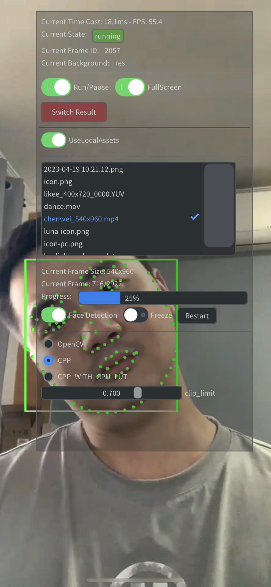
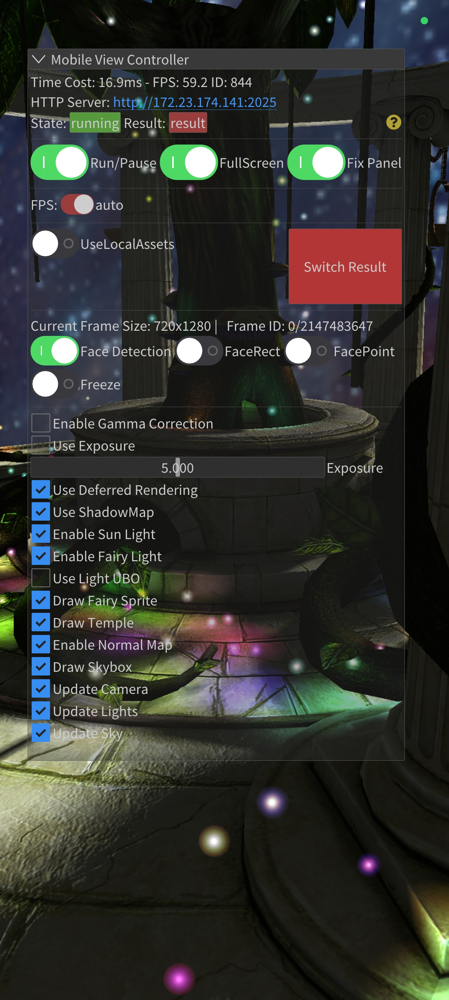
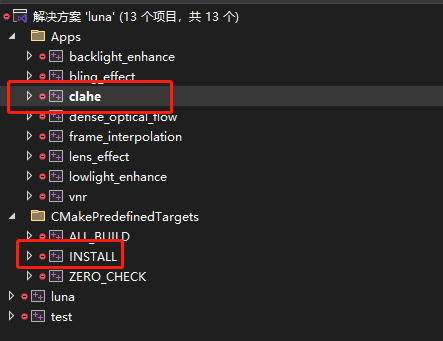
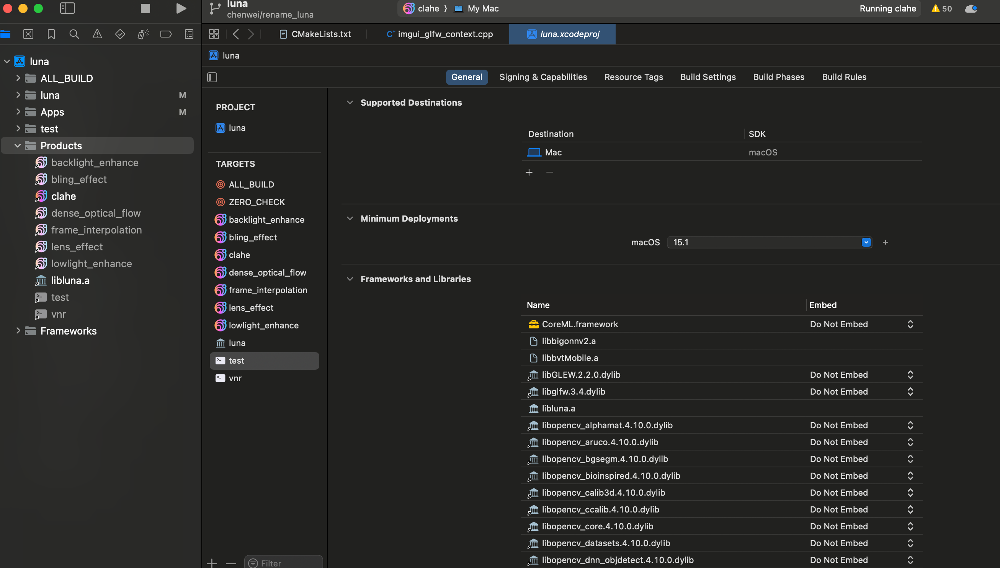
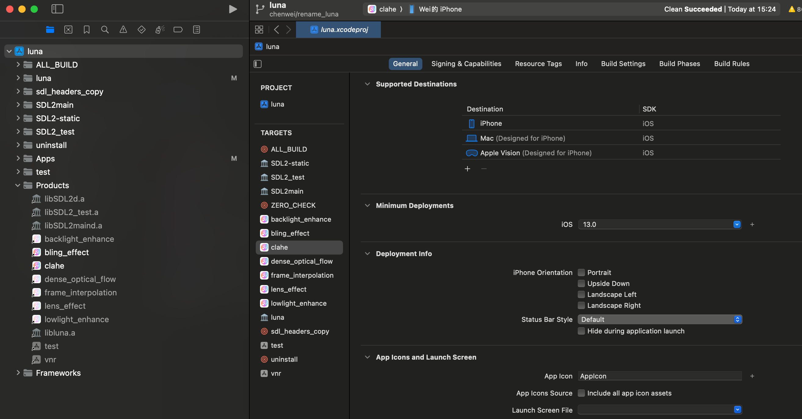
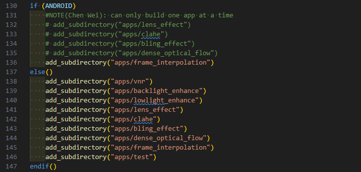
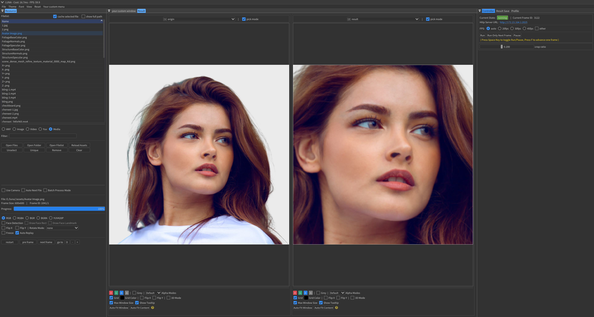

#  <span style="font-size: 1.2em;">LUNA (月神)</span>

```
This document is translated from chinese version by AI, and may be outdated, please forgive the inaccuracies.
```

> Write Once, Run Anywhere.

中文版本: [readme.md](readme.md)

## Table of Contents

- [ LUNA (月神)](#-luna-月神)
  - [Table of Contents](#table-of-contents)
  - [Project Description](#project-description)
  - [Project Running Example](#project-running-example)
  - [Build](#build)
    - [Windows：](#windows)
    - [macOS：](#macos)
    - [iOS：](#ios)
    - [Android：](#android)
  - [How to Start Your Own Project](#how-to-start-your-own-project)
  - [TODO-LIST](#todo-list)
  - [Technology Selection](#technology-selection)
    - [Regarding the GUI Framework](#regarding-the-gui-framework)
    - [Integration of Third-Party Libraries](#integration-of-third-party-libraries)
  - [Design philosophy](#design-philosophy)
  - [History](#history)


## Project Description

LUNA is a cross-platform C++ framework designed for the development of Graphic Image Algorithms. Upholding the principle of '**Develop once, run on multiple platforms**', it is dedicated to providing an efficient, flexible, and cross-platform development environment for Graphic Image Algorithm development.

The motivation behind the development of LUNA stems from the team's project experience. During the development of Graphic Image Algorithms, in addition to the core algorithm development work, we often need to:

- Handle various input formats (Video, Image, YUV, Camera, etc.).
- Save image results in different output formats (Video, Image, YUV, etc.).
- Visualize and compare image results.
- Perform real-time parameter tuning for the algorithms.
- Conduct performance testing.
- For GPU-related algorithm development, it is necessary to repackage the OpenGL context and interfaces.
- After completing development on the PC, when porting the algorithms to platforms (Android, iOS), it is essential to rebuild the project and support local file or Camera input.


In previous development processes, each independent project required the repetitive execution of the aforementioned tasks. Therefore, we aim to find a solution that can free us from tedious repetitive work, allowing us to dedicate more energy to algorithm development and innovation.

Based on the reasons mentioned above, we have gradually developed the LUNA framework, aiming to address the aforementioned issues and enabling developers to concentrate on the logic of the algorithms themselves without the need to worry about cross-platform porting.

These tasks primarily include:

- Unified abstraction and encapsulation of image reading, supporting inputs such as Video, Image, YUV, and Camera (PC, Android, iOS).
- Unified abstraction and encapsulation of image output, supporting outputs such as Video, Image, YUV, and allowing for the export of code or GUI configurations.
- During operation, it supports the visualization of images, facilitating real-time viewing and comparison.
- It supports a GUI module view for customizing algorithm parameter tuning, making real-time adjustments convenient.
- Implement the profile module to facilitate the testing of algorithm performance, and visualize it through the console or GUI.
- Provide a shallow encapsulation of OpenGL to mask the differences between OpenGL implementations across various platforms and offer a unified interface.
- For OpenGL 3D rendering, provide a comprehensive set of basic drawing functions (point, line, surface, mesh drawing, normal lighting, deferred lighting, shadows, etc.).
- A unified abstract framework that conceals the differences across platforms, allowing it to run on different platforms without any code modifications.

So far, LUNA has taken shape and has successfully achieved its established goals. We hope that LUNA can become a Swiss Army knife or a highly available scaffold for graphic image algorithm developers, enhancing the efficiency of algorithm development.

## Project Running Example

| PC platform ||
|---------|---------|
|  | |

| Mobile platform ||
|---------|---------|
|  | |


## Build
LUNA currently supports the Windows, macOS, iOS, and Android platforms. All platforms, except for Android, utilize CMake (version 3.25 and above) to generate project files.

If CMake is not installed, please install it first.

### Windows：
On the Windows platform, CMake is used to generate MSVC project files.

MSVC version: Visual Studio 2022 or later.

Build command:

```
build_for_vs.bat
```
The command above will generate Visual Studio project files, which will be located in the `build_vs` folder.

Open the Visual Studio project file, select either Debug or Release mode, set the startup project, and you can proceed with the compilation.



The first time you run it, you may encounter a 'DLL not found' error. Please execute the `INSTALL` project to copy the required DLLs to the directory of the executable file.

### macOS：
On the macOS platform, use CMake to generate Xcode project files. If Xcode is not installed, please install it first.

On macOS, you need to install dependencies such as `glfw3`, `glew`, and `opencv` using the `brew` command.

```
brew install glfw3
brew install glew
brew install opencv
```

Then, run the build command:

```
build_for_macos.sh
```

The command above will generate Xcode project files, which will be located in the `build_macos` folder.

Open the Xcode project file, select the corresponding scheme, and you can compile and run it:


### iOS：
On the iOS platform, use CMake to generate Xcode project files. If Xcode is not installed, please install it first.

Build command:

```
build_for_ios.sh
```

The command above will generate Xcode project files, which will be located in the `build_ios` folder.

Open the Xcode project file, select the corresponding scheme, set up the signing under 'Signing & Capabilities', connect the iPhone device (simulator is not supported at this time), and you can compile and run it:


### Android：

The Android platform utilizes CMake to build the C++ native code. The necessary App configuration is specified in the `CMakeLists.txt` file located in the project root directory.
As illustrated in the figure below:



If Android Studio is not installed, please install it first.

Next, use Android Studio to open the demo project located in the `build_android` folder, connect an Android device, and you will be able to compile and run the project.

Please note that the NDK version used for compiling C++ is NDK27, as detailed in the `build.gradle` file within the project.

When installing Android Studio for the first time to compile, you may need to set the environment variable `ANDROID_HOME` (Android SDK directory) or specify the `sdk.dir` variable in the `local.properties` file.

## How to Start Your Own Project

Currently, LUNA has several projects located in the `apps` folder for reference.

As a beginner, you can start with the `hello_luna` project, where we demonstrate a simple demo of an image center crop operation based on OpenGL:



You can read the source code of this demo to understand the core concepts of `luna`. When building your own app, you can copy the code from this project into your own app as a foundation.

All apps inherit from `ImGuiAppBase`, and it is advisable to carefully understand the main workflow (pipeline) of the app shown in the diagram below:


Regarding LUNA, the author (Chen Wei) has also given a presentation, which can be viewed here: [Cross-Platform Graphics and Image Development Framework—LUNA.pptx](docs/跨平台图形图像开发框架—LUNA.pptx)

If you need to configure algorithms in real-time through the UI, you may want to learn the basics of using imgui. You can refer to the [official documentation](https://github.com/ocornut/imgui) , which should take you about an hour.

## TODO-LIST
- [ ] filelist-TreeView
- [ ] The documentation is complete.


Issues (which do not significantly affect usage):
- [ ] The imgui-texture-inspect component has issues in multi-viewport mode (a fix is required from the component author).

## Technology Selection

### Regarding the GUI Framework
We chose `imgui` as our GUI framework primarily for the following reasons:
- We need the GUI to support cross-platform functionality, so we cannot select native GUI frameworks for PC, iOS, or Android platforms.
- We need to interact with C++, so we cannot select cross-language GUI frameworks like Flutter.
- The GUI library itself should not be overly complex or heavyweight, which excludes frameworks such as Qt.

ImGui, being a lightweight graphical interface library, supports cross-platform development (based on various backends) and is developed in C++, eliminating the need for cross-language bridging.

Based on the aforementioned reasons, we ultimately selected ImGui as the LUNA GUI framework and integrated several third-party component libraries for ImGui.

Naturally, ImGui has some inherent shortcomings. For instance, certain features lack comprehensive documentation, and its capabilities for complex component layouts are relatively limited, among other concerns.

### Integration of Third-Party Libraries

Description of Selected Third-Party Libraries:

| Library Name | Functionality | Description
|---------|---------|---------|
| imgui | GUI | Utilizing the imgui-adobe fork version, which enables docking and multiple viewport support. (Supports window docking and multiple viewports)|
| imgui-tex-inspect | Image Viewing | Displays texture data for result visualization (the component's multi-viewport support has issues, so we have disabled docking mode for this component)|
| imgui-toggle | Toggle Button | Toggle Button Control|
| imGuiNotify | Notification Message | Used to display notification messages (Toast)|
| imPlot | Curve Plotting | Used to display performance profile curves (PC side)|
| ImGuizmo | 3D Rendering | 3D rendering scene, concerning the camera control component |
| glfw | Window Management, functioning as the backend for imgui | Using GLFW for OpenGL context management on macOS and Windows|
| sdl3 | Window Management, functioning as the backend for imgui | Using SDL for OpenGL context management on iOS and Android|
| sdl-gesture| Window Management | SDL auxiliary library for handling multi-touch gesture events |
| glew | openGL extension | OpenGL interface support on macOS and Windows
| opencv | Image Processing | Building on the Android platform after integrating the FFmpeg library; other platforms can download it from the official website|
| eigen | Matrix Operations | Matrix operation library supporting linear algebra, as well as matrix and vector operations|
| glm | Matrix Operations | Matrix operation library supporting linear algebra, matrix, and vector operations (primarily for OpenGL coordinate transformations)|
| libfort | Console Table Output | Used to display performance profile data (mobile)|
| tabulate | Console Table Output | Used to display performance profile data (PC)|
| nativefiledialog | File Dialog | For file selection (PC side)|
| ordered-map | Basic data structures| Map/set containers that maintain insertion order |
| bvt | Face detection | For face detection and other deep learning inference |
| stb | Image Processing | Image file reading and retention |
| watcher | Basic functionalities | File modification monitoring |
| cpp-httplib | Basic functionalities | C++ HTTP server, used to provide file browser services |
| miniz | Basic functionalities | File compression functionality |
| nlohmannn-json | Basic functionalities | JSON-related processing |

## Design philosophy

The original intention behind LUNA's design is to serve the development of graphical image algorithms. We aim for LUNA to be lightweight, flexible, versatile, and cross-platform, achieving the goal of [one-time development, multi-platform operation].

Furthermore, we have also attempted to consider the following points during the implementation process:
- **Abstract Implementation**. Each abstract implementation is sufficiently refined and clean, **with every abstraction carefully considered and subjected to multiple iterations and refinements**. At the same time, we will strive to ensure the granularity of the abstractions, avoiding over-design and preventing excessive cognitive costs.
- **Component Decoupling**. Components should be decoupled as much as possible, with each component being sufficiently cohesive and largely independent of other components. Each component is nearly [plug-and-play], and if necessary, can be directly copied for use in other projects.
- **Unified Interfaces**. The interfaces of components should be as unified as possible to facilitate integration and usage.
- **The code is clear**. The code possesses a reasonable structure, an excellent coding style, and is easy to understand and maintain.

We hope to continuously learn more outstanding technologies and design concepts during the development of LUNA and to implement them in LUNA.
For instance, the current compilation and build process of LUNA utilizes the latest C++ 23 standard, enabling development with the newest features of C++ 23.

We hope that LUNA will not only be used for graphic and image algorithm development but will also continue to evolve, ultimately being recognized as a public foundational library that includes a variety of common \[reusable] components.

## History

The original name of this project `Andromeda(仙女座)`, which was later renamed to `LUNA(月神)`, to avoid confusion with `Android` .